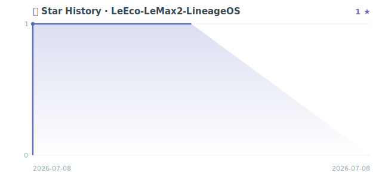

<div align="center">


<br/>


<br/><br/>


<br/><br/>

**If it helps, a Star means a lot · 如果对你有帮助,点个 Star ⭐ 支持一下**

[简体中文](README.md) | English

</div>

---

## TL;DR

**LeEco-LeMax2-LineageOS** is the unified hub for a **from-source LineageOS 18.1 (Android 11) port** of the **LeEco Le Max 2 (x2 / LEX820, Snapdragon 820 / MSM8996)**. This 2016 flagship was frozen by the vendor at **Android 6.0.1** and abandoned for eight years. This project rebuilds the device tree, platform common, kernel and vendor blobs from the **LineageOS source tree**, jumping **5 major Android versions**, and brings the phone to a **stable Android 11 on real hardware** — `sys.boot_completed=1`, correct LEX820 detection, dual-SIM enabled, every claim re-checkable via `build.prop`. How to use: `repo init lineage-18.1` → add this project's local_manifests → `brunch x2` → sideload in recovery. Use cases: reviving abandoned flagships, learning msm8996 custom-ROM porting, LineageOS build troubleshooting reference. **Honesty line: the real-device stable version is Android 11; Android 16 is roadmap exploration only — not shipped, not claimed.**

---

## Table of Contents

- [Death & Rebirth of a Flagship](#death--rebirth-of-a-flagship)
- [Real-Device Verified Facts](#real-device-verified-facts)
- [Why This Device Is Hard](#why-this-device-is-hard)
- [Pits Conquered · Engineering Log](#pits-conquered--engineering-log)
- [Component Repository Index](#component-repository-index)
- [Build from Source](#build-from-source)
- [Flashing Guide](#flashing-guide)
- [Roadmap](#roadmap)
- [About the Author](#about-the-author)

---

## Death & Rebirth of a Flagship

> Some devices don't deserve to be obsoleted by time — they were simply abandoned by maintenance.

| Timeline | Status | What Happened |
| :--- | :--- | :--- |
| **2016 · Peak** | 🏆 Flagship | Snapdragon 820, 2K display, metal body — top-tier that year |
| **Late 2016 · Frozen** | ⛔ EOL | Vendor pushed a final **Android 6.0.1**, then went permanently silent |
| **8 years · Forgotten** | 🪦 Abandoned | Stuck on Android 6, left behind by security updates and the ecosystem |
| **Today · Reborn** | 🌱 Revived | **Rebuilt from LineageOS source**, running **Android 11 (LineageOS 18.1)** on real hardware |

Device tree, platform common, kernel and vendor blobs are all self-maintained, spanning **5 major versions** to bring an eight-year-old flagship to modern Android.

`Android 6.0.1` ⛔ ⟶ `7` ⟶ `8` ⟶ `9` ⟶ `10` ⟶ **`Android 11`** ✅ · `Android 16 🧭 roadmap exploration`

---

## Real-Device Verified Facts

Honesty is the baseline of hardcore engineering. Every item below runs and is reproducible on real hardware:

| Check | Result | Evidence |
| :-- | :-: | :-- |
| Boot | ✅ `sys.boot_completed = 1` | `adb shell getprop` |
| Home screen | ✅ Launcher works, interactive | real device |
| Android version | ✅ **Android 11** (`ro.build.version.release = 11`) | `build.prop` |
| Model detection | ✅ Correctly detects **LEX820** (source-level fix) | `ro.product.model` |
| Dual-SIM | ✅ Dual-SIM mode enabled (dsds) | `persist.radio.multisim.config` |
| Baseband / RF | ✅ Baseband firmware loaded and online | `gsm.version.baseband` |
| Call/Data/WiFi/BT/Camera | 🔧 Not yet tested item-by-item with SIM | pending real-device test |
| Android 16 | 🧭 Roadmap exploration (Treble GSI), **not shipped** | — |

> 🧭 **No-overclaim line:** the stable, real-device version of this ROM is **Android 11 / LineageOS 18.1**. Android 16 is an ongoing technical direction — **not shipped, not claimed**. Only what can be verified on real hardware gets written here.

---

## Why This Device Is Hard

This is not a "sync source, hit build, done" job:

- **Zero vendor support**: LeEco is defunct — no maintained kernel, no new blobs, no official device tree. Everything rebuilt from scratch.
- **Stale closed blobs**: many msm8996 proprietary binaries are stuck on old vendor; upward adaptation means hand-aligning HAL and SEPolicy.
- **Variant minefield**: Le Max 2 spans `x820 / x821 / x829` sub-models with different baseband, partitions and checks — misidentify one and it bricks.
- **Broken modern toolchain**: building 2020's LOS 18.1 on a 2024/2025 host hits pitfalls all the way through.

---

## Pits Conquered · Engineering Log

| Pit | Symptom | Root Cause | How It Was Conquered |
| :-- | :-- | :-- | :-- |
| **ncurses5 break** | Old clang crashes on launch on modern Ubuntu | LOS 18.1 prebuilt clang depends on deprecated `libncurses.so.5` | Create `.so.6 → .so.5` compat symlink, restore the whole host toolchain |
| **webview LFS pointer** | Build hangs at 99% on `webview.apk` | `repo sync` without `--git-lfs` checks out an LFS pointer, not the real file | Clone the repo separately and `git lfs pull` the real image |
| **mke2fs orphan_file** | ART APEX / system image generation fails | New e2fsprogs `mke2fs.conf` ships `orphan_file` the old tool can't parse | Remove `orphan_file` from `/etc/mke2fs.conf` |
| **/data bootloop** | Stuck at boot animation, `credstore` crash loop | `fastboot erase` wipes but creates no filesystem, `/data` fails to mount | Use `fastboot format` / let first boot build ext4 itself |
| **Model UNKNOWN** | Pure fastboot flash shows UNKNOWN, loses dual-SIM | fastboot flash skips recovery's `devinfo.sh`, `ro.leeco.devinfo` stays `NULL` | Device tree falls back on `NULL`/empty to `le_x2_whole_netcom` (LEX820) |

---

## Component Repository Index

This repo is the **unified entry point** for the whole port. The actual source lives across the component repos below; `android_local_manifests` pulls them all in automatically during `repo sync`:

| Repository | Role | Notes |
| :-- | :-- | :-- |
| [**android_local_manifests**](https://github.com/Pangu-Immortal/android_local_manifests) | 🧭 Orchestration manifest | One command pulls in every tree below |
| [**android_device_leeco_x2**](https://github.com/Pangu-Immortal/android_device_leeco_x2) | 📱 Device tree | Partition table, fstab, model detection, product definitions |
| [**android_device_leeco_msm8996-common**](https://github.com/Pangu-Immortal/android_device_leeco_msm8996-common) | 🧩 Platform common | Snapdragon 820 shared HAL, SEPolicy, common config |
| [**android_kernel_leeco_msm8996**](https://github.com/Pangu-Immortal/android_kernel_leeco_msm8996) | 🐧 Kernel | Custom msm8996 kernel source |
| **proprietary_vendor_leeco** 🔒 | 🔐 Proprietary blobs | Vendor binaries · private repo, copyright held by the OEM |

---

## Build from Source

> Recommended host: Ubuntu 20.04 / 22.04 · 16C/32G+ · 300 GB+ free space · [LineageOS build deps](https://wiki.lineageos.org/devices/) configured.

```bash
# 1. Init the LineageOS 18.1 source tree
repo init -u https://github.com/LineageOS/android.git -b lineage-18.1 --git-lfs

# 2. Add this project's local_manifests (auto-wires device / common / kernel / vendor)
git clone https://github.com/Pangu-Immortal/android_local_manifests .repo/local_manifests

# 3. Sync all source
repo sync -c --no-clone-bundle --optimized-fetch -j"$(nproc --all)"

# 4. Set up env and select the device
source build/envsetup.sh
breakfast lineage_x2-userdebug        # codename: x2

# 5. Full build
brunch x2
# Output: out/target/product/x2/lineage-18.1-*-x2-signed.zip
```

---

## Flashing Guide

> ⚠️ **Unlocking the bootloader wipes all data; flashing carries a brick risk. Make a full partition backup first — it is your only undo.** Confirm the device is Le Max 2 (`x2`) first.

```bash
# 1. Enter bootloader and unlock (first time only, wipes data)
adb reboot bootloader
fastboot oem unlock

# 2. Flash LineageOS Recovery and boot into it
fastboot flash recovery lineage-18.1-recovery-x2.img
fastboot reboot recovery

# 3. In Recovery run Wipe → Format Data
#    Critical step: resolves the msm8996 forced-encryption bootloop

# 4. Sideload the system package (first boot takes a while, be patient)
adb sideload lineage-18.1-*-x2-signed.zip
```

**Post-flash self-check — let evidence speak:**

```bash
adb shell getprop ro.build.version.release   # expect: 11
adb shell getprop sys.boot_completed         # expect: 1
adb shell getprop ro.lineage.build.version   # expect: 18.1
```

---

## Roadmap

- ✅ **Android 11 / LineageOS 18.1** — shipped, verified on real hardware.
- 🔧 **Stability polish** — VoLTE, camera HAL, sleep power draw under continuous tuning.
- 🔬 **Treble / GSI compatibility** — building a base to run newer AOSP GSIs.
- 🧭 **Higher Android versions (incl. Android 16 GSI compatibility)** — **ongoing exploration, not shipped**; usability is judged solely by real-device `build.prop`, never announced early.

> We draw a hard line between "roadmap" and "shipped": every promised step must be reproducible and falsifiable on real hardware.

---

<div align="center">

## Star History

<a href="https://star-history.com/#Pangu-Immortal/LeEco-LeMax2-LineageOS&Date"></a>

<br/><br/>

## About the Author

**Primary focus · LLM algorithms / AI engineering / on-device AI** — building LLM applications, Agentic systems (LangGraph · A2A · MCP · ADK · GraphRAG), and on-device offline multimodal inference (mobile / in-vehicle offline language, image & video generation, world models). This is where I invest the most.

**Technical hobby · systems & reverse engineering** — ROM porting, reviving old devices and reverse engineering are areas I'm genuinely fascinated by.

<br/>

**Open to collaboration** · LLM / Agent system delivery · ROM customization & reverse-engineering consulting

<a href="mailto:yugu88@126.com"></a>
<a href="https://github.com/Pangu-Immortal"></a>

<br/><br/>

<sub>Licensed under Apache-2.0, commercial use allowed (kernel under GPL-2.0, inherited from upstream) · Not affiliated with LeEco, Google, Qualcomm or the LineageOS project · Device names and trademarks belong to their respective owners · Flashing and bootloader unlocking risk data loss and bricking — back up and proceed at your own risk.</sub>


</div>
